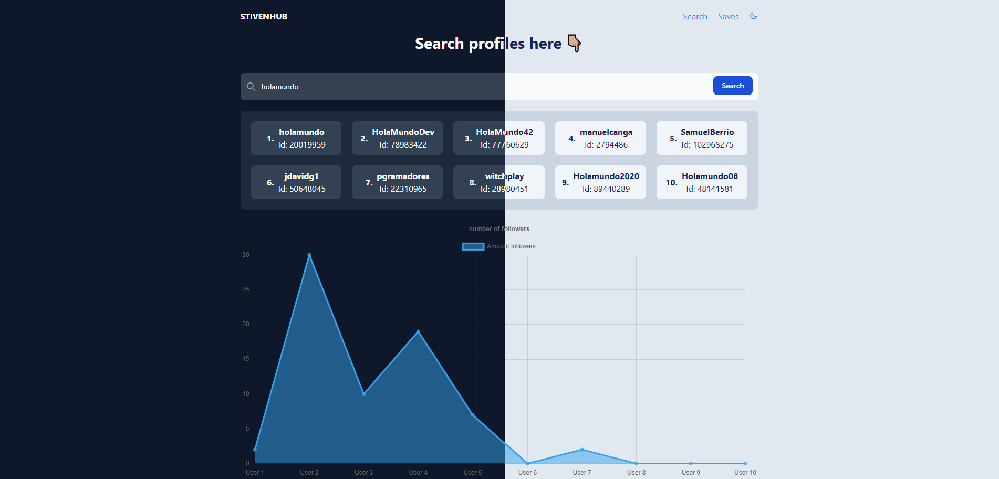

# StivenHub

es una aplicación simple y poderosa que te permite explorar perfiles de usuarios en GitHub y, además, guardar tus perfiles favoritos en una base de datos personalizada. Esta aplicación se encuentra disponible en el siguiente enlace: Enlace

## Funcionalidades clave:

-   Exploración de Perfiles de GitHub: La aplicación te permite buscar y visualizar perfiles de usuarios en GitHub. Puedes explorar su información pública, repositorios, seguidores y más.

-   Guardar Perfiles Favoritos: Si encuentras un perfil que te gusta, puedes agregarlo a tu lista de perfiles favoritos. Esto facilita el seguimiento de usuarios que te interesan.

-   Cantidad de seguidores: En forma de grafica podemos mirar cuantos seguidores tienen los usuarios que consultamos.

### Cómo usar la app:

Para utilizar la aplicación, sigue estos sencillos pasos:

1. Accede al enlace de la aplicación: Enlace de GitHub Profile Saver.

2. Si deseas utilizar la aplicación sin clonar el repositorio, puedes hacerlo directamente en el enlace proporcionado.

3. Si prefieres clonar el repositorio y ejecutar la aplicación en tu propio entorno, asegúrate de obtener un token de GitHub siguiendo las instrucciones en el archivo example.env.

4. El backend de nuestra aplicación está diseñado para simplificar al máximo la configuración. Hemos integrado variables de entorno que hacen que todo el proceso sea más eficiente. Con esta configuración, la única tarea que deben realizar es levantar un contenedor Docker utilizando el archivo docker-compose.yml. De esta manera, obtendrán rápidamente una base de datos completamente funcional y lista para su uso.

5. Explora perfiles de usuarios en GitHub y guarda tus favoritos utilizando la función de guardado proporcionada.
